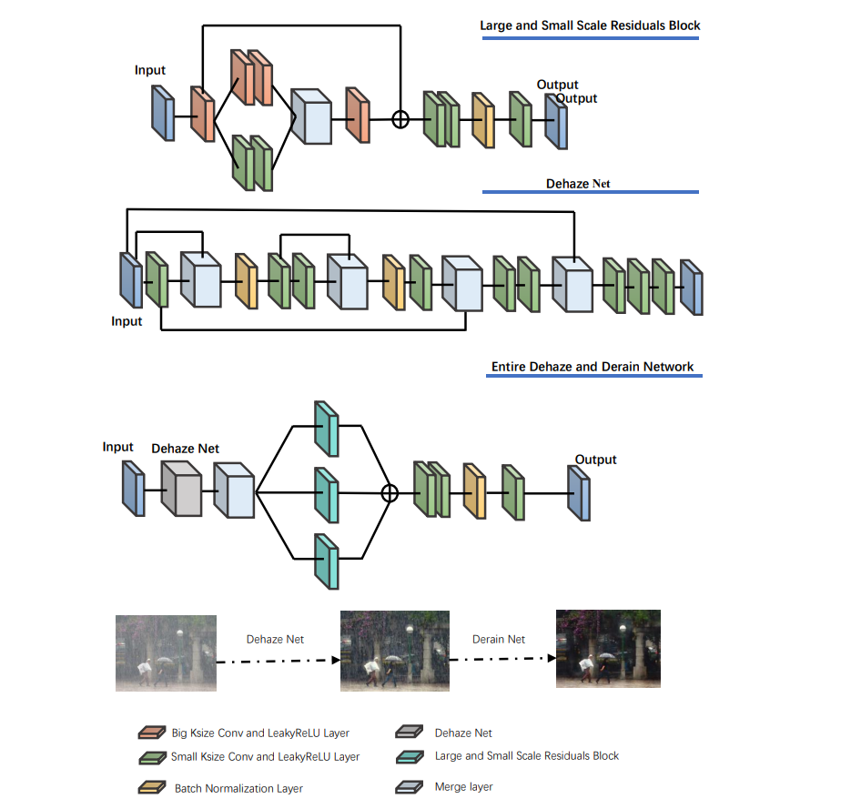
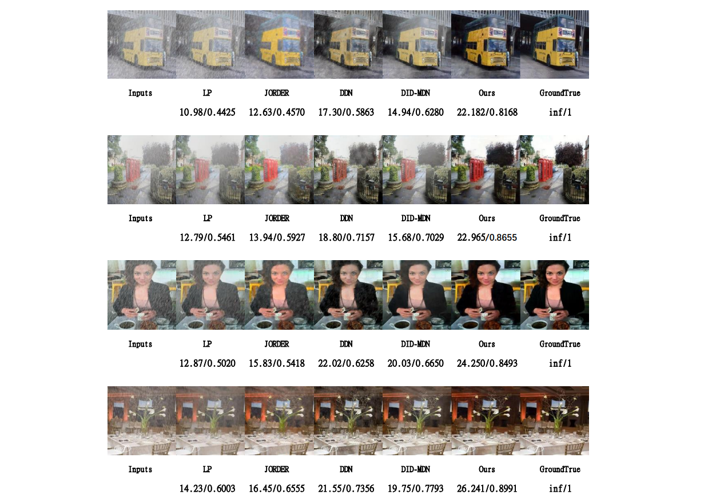
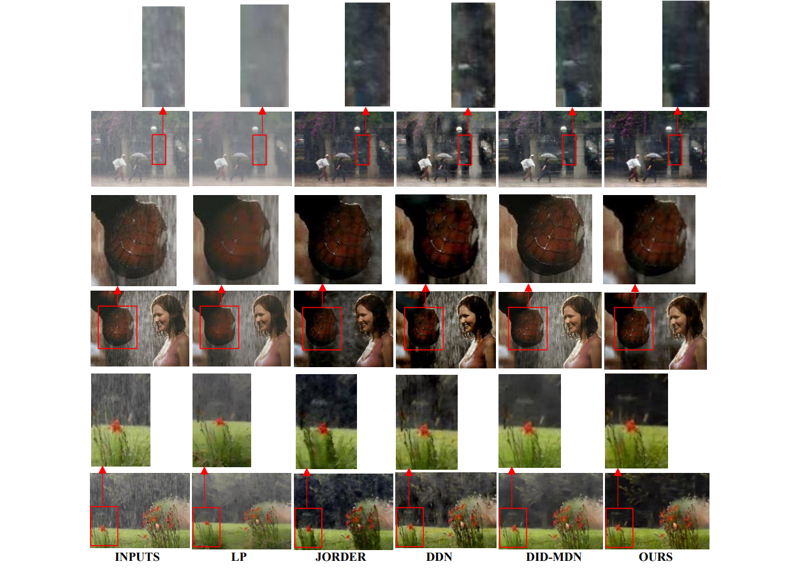

# Convolutional Network for Joint Restoration of Complex-Images of Fog and Rainfall

## Network Architecture

We propose a residual structure layer of large and small receptive fields to refine the characteristics of high receptive fields and low receptive fields. Specifically, the convolution core with large receptive field is used for some convolution layers in the network, and 3 × 3 to fuse the large and small receptive fields and add them to the input layer of the structure to form the large and small receptive field fusion residual structure layer.

## Experimental Result

We compare the effects of various methods by using two test indicators, namely, peak signal to noise ratio (PSNR) and structural similarity (SSIM), in objective values. Rainfall density is used as the judgment standard for heavy rain, moderate rain and light rain respectively. 

|  Test Index &nbsp;&nbsp;&nbsp;&nbsp;&nbsp;&nbsp;&nbsp;&nbsp;&nbsp;&nbsp;&nbsp;&nbsp;&nbsp;&nbsp;&nbsp;&nbsp;&nbsp;&nbsp;&nbsp;&nbsp;&nbsp;&nbsp;&nbsp;&nbsp;&nbsp;&nbsp;&nbsp;&nbsp;&nbsp;&nbsp;&nbsp;&nbsp;&nbsp;&nbsp;&nbsp;&nbsp;   | PSNR  | SSIM  |
|  ----  | ----  | ----  |
| LP  | 16.070 | 0.6668 |
| JORDER  | 18.675 | 0.7043 |
| DDN  | 21.897 | 0.7487 |
| DID-MDN  | 20.472 | 0.7880 |
| **OURS**  | **24.531** | **0.8751** |

Because of the fogging of the data, the difficulty of image restoration is further increased, resulting in the decline of the overall test indicators. It can be seen that many networks are not sensitive to the treatment after rain atomization, as shown in the following figure. Our method performs better than other results in processing complex rainfall images.

The real rainfall image does not have rain free images for PSNR and SSIM calculation like the composite image, but we can feel the effect of network processing in this paper through subjective evaluation, as shown in the figure below.

The following table shows the average running time of processing 1200 test images, all of which are 512 × 512 color images, our algorithm has more advantages.

|   &nbsp;&nbsp;&nbsp;&nbsp;&nbsp;&nbsp;&nbsp;&nbsp;&nbsp;&nbsp;&nbsp;&nbsp;&nbsp;&nbsp;&nbsp;&nbsp;&nbsp;&nbsp;&nbsp;&nbsp;&nbsp;&nbsp;&nbsp;&nbsp;  | LP  | JORDER  | DDN  | DID-MDN  | **OURS**  |
|  ----  | ----  | ----  | ----  | ----  | ----  |
| 512 × 512  | 2164.58 | 1.69 | 0.40 | 0.62 | **0.37** |

## Prerequisites:
1. Linux
2. Python 2 or 3
3. CPU or NVIDIA GPU + CUDA CuDNN (CUDA 8.0)
 
## Installation:
1. Install PyTorch and dependencies from http://pytorch.org (Ubuntu+Python2.7)
   (conda install pytorch torchvision -c pytorch)

2. Install Torch vision from the source.
   (git clone https://github.com/pytorch/vision
   cd vision
   python setup.py install)

3. Install python package: 
   numpy, scipy, PIL, pdb
   
## Demo using pre-trained model
	python test.py --dataroot ./facades/github --valDataroot ./facades/github --netG ./pre_trained/netG_epoch_9.pth   
Pre-trained model can be downloaded at (put it in the folder 'pre_trained'): https://drive.google.com/drive/folders/1VRUkemynOwWH70bX9FXL4KMWa4s_PSg2?usp=sharing

Pre-trained density-aware model can be downloaded at (Put it in the folder 'classification'): https://drive.google.com/drive/folders/1-G86JTvv7o1iTyfB2YZAQTEHDtSlEUKk?usp=sharing

Pre-trained residule-aware model can be downloaded at (Put it in the folder 'residual_heavy'): https://drive.google.com/drive/folders/1bomrCJ66QVnh-WduLuGQhBC-aSWJxPmI?usp=sharing

## Training (Density-aware Deraining network using GT label)
	python derain_train_2018.py  --dataroot ./facades/DID-MDN-training/Rain_Medium/train2018new  --valDataroot ./facades/github --exp ./check --netG ./pre_trained/netG_epoch_9.pth.
	Make sure you download the training sample and put in the right folder

## Density-estimation Training (rain-density classifier)
	python train_rain_class.py  --dataroot ./facades/DID-MDN-training/Rain_Medium/train2018new  --exp ./check_class	

## Testing
	python demo.py --dataroot ./your_dataroot --valDataroot ./your_dataroot --netG ./pre_trained/netG_epoch_9.pth   

## Reproduce

To reproduce the quantitative results shown in the paper, please save both generated and target using python demo.py  into the .png format and then test using offline tool such as the PNSR and SSIM measurement in Python or Matlab.   In addition, please use netG.train() for testing since the batch for training is 1. 
 
## Dataset
Training (heavy, medium, light) and testing (TestA and Test B) data can be downloaded at the following link:
https://drive.google.com/file/d/1cMXWICiblTsRl1zjN8FizF5hXOpVOJz4/view?usp=sharing

## License
Code is under MIT license. 

